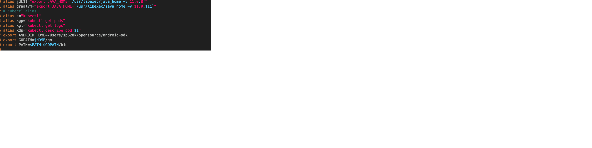
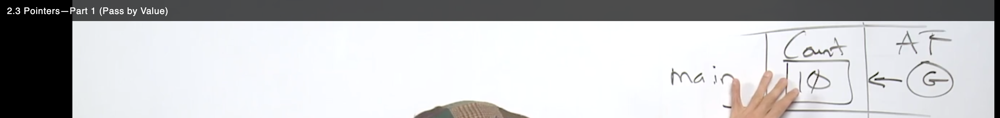
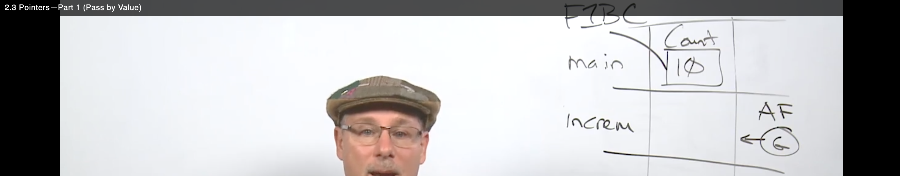
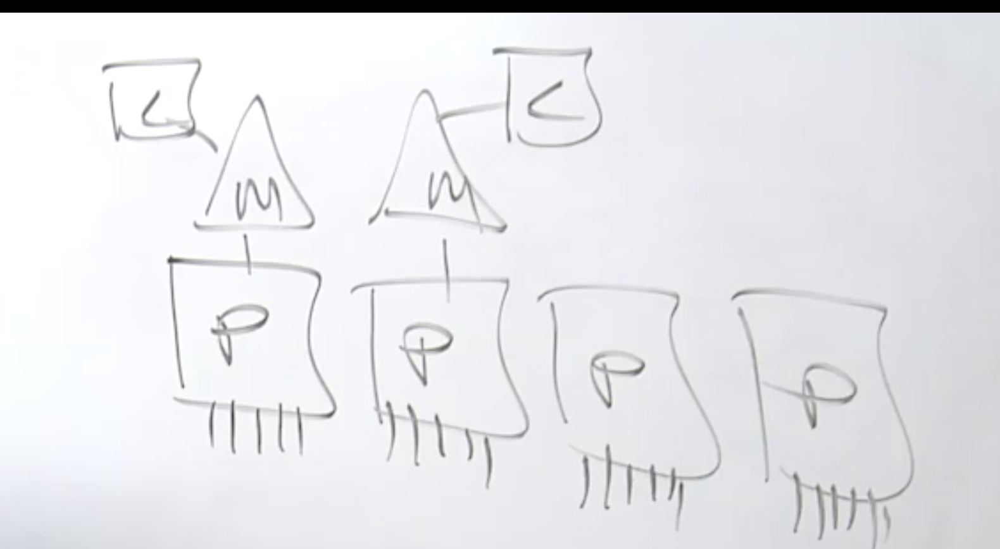
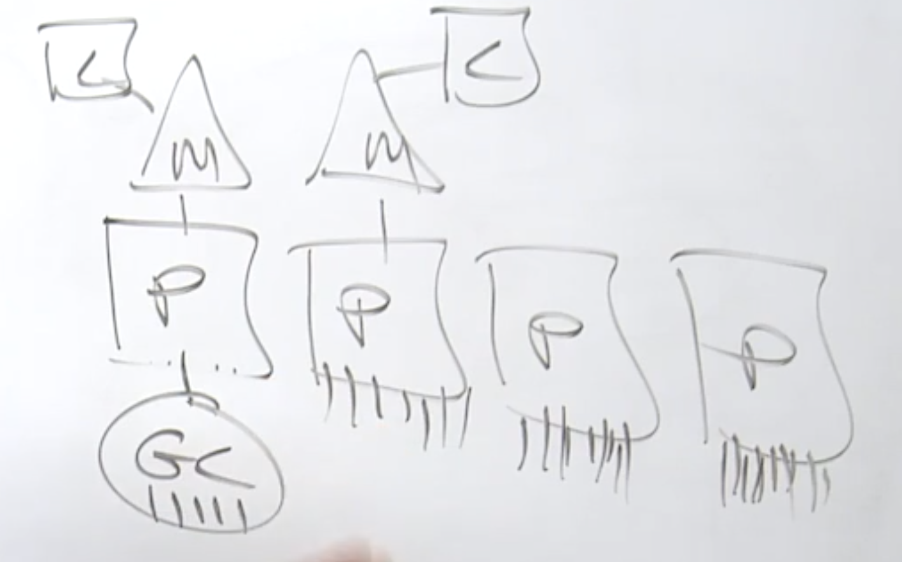

go run <package.go>

# Create executable
go build <package.go>


go mod init github.com/sudeep/packer 

# GOPATH
By default, this workspace is located in $HOME/go, with source code for these tools stored in $HOME/go/src and the compiled binaries in $HOME/go/bin. You can use this default or specify a different workspace by setting the $GOPATH environment variable.

Whether or not you use the default location, it’s a good idea to explicitly define GOPATH and to put the $GOPATH/bin directory in your executable path. Explicitly defining GOPATH makes it clear where your Go workspace is located and adding $GOPATH/bin to your executable path makes it easier to run third-party tools installed via go install, which we’ll talk about in a bit.



## Installing 3rd Party tool
The go install command takes an argument, which is the location of the source code repository of the project you want to install, followed by an @ and the version of the tool you want (if you just want to get the latest version, use @latest). It then downloads, compiles, and installs the tool into your $GOPATH/bin directory.
```sh
 go install github.com/rakyll/hey@latest
 hey https://www.golang.org
```


## golint

```sh
go install golang.org/x/lint/golint@latest
golint .

Another optoin to linter
golangci-lint run


You can configure which linters are enabled and which files they analyze by including a file named .golangci.yml at the root of your project. Check out the documentation for the file format.
```
That runs golint over your entire project.
golint ./...


## go vet
There is another class of errors that developers run into. The code is syntactically valid, but there are mistakes that are not what you meant to do. This includes things like passing the wrong number of parameters to formatting methods or assigning values to variables that are never used. The go tool includes a command called go vet to detect these kinds of errors. Run go vet on your code with the command:
```sh
go vet ./...  
```


## Detecting Shadowed Variables

$ go install golang.org/x/tools/go/analysis/passes/shadow/cmd/shadow@latest
```makefile
vet:
        go vet ./...
        shadow ./...
.PHONY:vet
```

# Creating module and using locally
mkdir hello
cd hello
go mod init example.com/hello


Edit the example.com/hello module to use your local example.com/greetings module.
For production use, you’d publish the example.com/greetings module from its repository (with a module path that reflected its published location), where Go tools could find it to download it. For now, because you haven't published the module yet, you need to adapt the example.com/hello module so it can find the example.com/greetings code on your local file system.

To do that, use the go mod edit command to edit the example.com/hello module to redirect Go tools from its module path (where the module isn't) to the local directory (where it is).

From the command prompt in the hello directory, run the following command:
```sh
$ go mod edit -replace example.com/greetings=../greetings

go.mod file
replace example.com/greetings => ../greetings
```

From the command prompt in the hello directory, run the go mod tidy command to synchronize the example.com/hello module's dependencies, adding those required by the code, but not yet tracked in the module.
$ go mod tidy


go clean -modcache


OS Stack Memory size = 1M
GoRouting Stack Memory size = 2K
Frame of Memory - Go routing has direct access to frame of memory is chunk of stack memory, this gives immutability and very powerful


Pass by value, new frame



// Escape Analysis, moves it to heap escapes from stack, compiler makes static code analysis

# Stack in go
Stack 2k in go another new stack is creaed when full and copy existing to new with 25% more thano original

# Garbage Collection
Try color, Mark / Sweep Garbage collector

100MICRO SECOND Garbage collector time allowed / 25% on cpu used by GC



GC uses go routine
